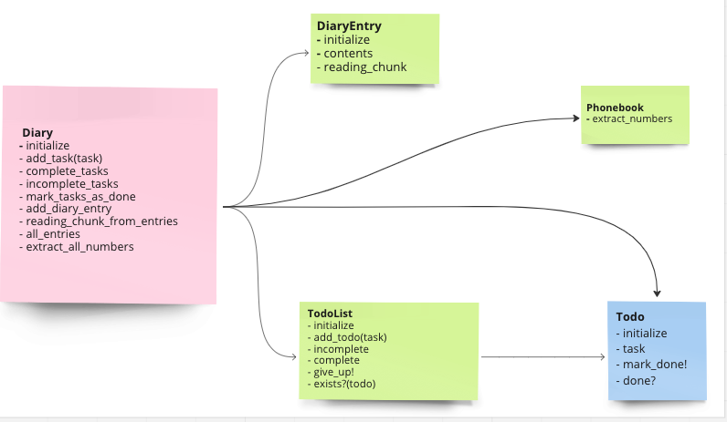

# {{PROBLEM}} Multi-Class Planned Design Recipe

## 1. Describe the Problem

_Put or write the user story here. Add any clarifying notes you might have._

> As a user
> So that I can record my experiences
> I want to keep a regular diary

> As a user
> So that I can reflect on my experiences
> I want to read my past diary entries

> As a user
> So that I can reflect on my experiences in my busy day
> I want to select diary entries to read based on how much time I have and my reading speed

> As a user
> So that I can keep track of my tasks
> I want to keep a todo list along with my diary

> As a user
> So that I can keep track of my contacts
> I want to see a list of all of the mobile phone numbers in all my diary entries

### Goals
> record entries
> read past entries
> select entries to be read based on time available
> track completed tasks and tasks to be completed
> list of phone numbers from the entries

### Non-Goals
> match the phone number with a name
> list entries in some order
> extract a todo list from a diary entry

## 2. Design the Class System

_Consider diagramming out the classes and their relationships. Take care to
focus on the details you see as important, not everything. The diagram below
uses asciiflow.com but you could also use excalidraw.com, draw.io, or miro.com_



_Also design the interface of each class in more detail._

```ruby
class Diary
  def initialize
  end

  def add_task(task) #task is an instance of Todo
  end

  def complete_tasks
    # returns completed tasks
  end

  def incomplete_tasks
    # returns incomplete tasks
  end

  def mark_tasks_as_done
    # returns all tasks as done
  end

  def add_diary_entry(entry) # entry is an instance of DiaryEntry
  # entry is a string
  end

  def reading_chunk_from_entries(wpm, minutes) #wpm refers to the reading speed in words per minute.
  # minutes is the available time to read the text
  # wpm and minutes are integers
  end

  def all_entries
  # returns entries
  and

  def extract_all_numbers
  # extract number from the entries
  end

  class Todolist
    def initialize
    end

    def add(todo) # todo is a string

    def incomplete
      # returns false if the task has not been marked done
    end

    def complete
      # returns true if the task has been marked done
    end

    def give_up!
      # returns if the todolist has been all marked done
    end

    def exists?
      # returns true if the todo is alrady in the list
    end
  end


class Todo
  def initialize
  end

  def task
   # returns task as a string
  end

  def mark_done!
  # returns nothing marks the todo as done
  end

  def done?
  # returns true if the task is done
  # otherwise false
  end

class DiaryEntry
  def initialize(title, contents) # contents and title are strings
  end

  def  title
  end

  def contents
  end

  def count_words
  end

  def reading_time(wpm) # is an integer
  end

  def reading_chunk(wpm, minutes) # wpm and minutes are both integers
    # returns the contents that can be read
  end

class Phonebook
  def extract_numbers(text) # text is a string
  # returns the numbers and push them to the @numbers array
  end
```

```ruby
class MusicLibrary
  def initialize
    # ...
  end

  def add(track) # track is an instance of Track
    # Track gets added to the library
    # Returns nothing
  end

  def all
    # Returns a list of track objects
  end

  def search_by_title(keyword) # keyword is a string
    # Returns a list of tracks with titles that include the keyword
  end
end

class Track
  def initialize(title, artist) # title and artist are both strings
  end

  def format
    # Returns a string of the form "TITLE by ARTIST"
  end
end
```

## 3. Create Examples as Integration Tests

_Create examples of the classes being used together in different situations and
combinations that reflect the ways in which the system will be used._

```ruby
# Diary Class
# 1 adding a task
task = Todo.new('laundry')
diary = Diary.new
diary.add_task(task) # => not to raise an error
diary.incomplete_tasks.length # => 1

# 2 raise an error when the task is not an instance of Todo
diary = Diary.new
diary.add_task('wrong type') # => 'Not a Todo instance'

# 3 incomplete tasks
task = Todo.new('laundry')
diary = Diary.new
diary.add_task('laundry')
diary.incomplete_tasks # => 'laundry'

# 4 completed tasks
task = Todo.new('laundry')
diary = Diary.new
diary.add_task('laundry')
diary.incomplete_tasks.mark_done!
diary.complete_tasks # => 'laundry'

# 5  marks_tasks_as_done when all tasks have been completed
diary = Diary.new
diary.add_task('shopping')
diary.add_task('cooking')
diary.add_task('laundry')
diary.add_task('cleaning')
diary.incomplete_tasks.length # => 4
diary.incomplete_tasks.mark_done!
diary.complete_tasks # => 4

# 6 adding an entry
entry = DiaryEntry.new('my_title', 'my_contents')
entry = Diary.new
diary.add_diary_entry(entry) # => not to raise an error
diary.all_entries.length # => 1

#7 raises and error if not an argument of DiaryEntry
entry = Diary.new
diary.add_diary_entry('not a diary entry') # => raise an error
# => 'Not an instance of DiaryEntry'

```

## 4. Create Examples as Unit Tests

_Create examples, where appropriate, of the behaviour of each relevant class at
a more granular level of detail._

```ruby

# Todolist
# 1 adds task
todo_list = TodoList.new
todo = Todo.new('laundry')
todo_list.add(todo)
todo_list.incomplete.task # => 'laundry'

# 2 multiple tasks
todo_list = TodoList.new
todo1 = Todo.new('laundry')
todo2 = Todo.new('shopping')
todo_list.add(todo1)
todo_list.add(todo2)
todo_list.incomplete.task # => 'laundry'
todo_list.incomplete.task # => 'shopping'

# 3 duplicates will not be repeated
todo_list = TodoList.new
todo1 = Todo.new('laundry')
todo2 = Todo.new('laundry')
todo_list.add(todo1)
todo_list.add(todo2)
todo_list.incomplete.task # => 'laundry'

# 4 raises an error when an instance is a Todo
todo_list = TodoList.new
todo_list.add('not a Todo instance') # => raise an error "Not a Todo instance"

# 5 incomplete tasks
todo_list = TodoList.new
todo = Todo.new('laundry'
todo_list.incomplete.empty? # => true
todo_list.add(todo)
todo_list.incomplete.empty? # => false

# 6 complete tasks
todo_list = TodoList.new
todo = Todo.new('laundry')
todo_list.add(todo)
todo_list.complete # => []
todo.mark_done!
todo_list.complete.length # => 1

# 7 give up when all the tasks are marked done
todo_list = TodoList.new
todo1 = Todo.new('laundry')
todo2 = Todo.new('shopping')
todo3 = Todo.new('cleaning')
todo_list.add(todo1)
todo_list.add(todo2)
todo_list.add(todo3)
todo_list.incomplete.lenght # => 3
todo.give_up!
todo_list.complete.length # => 3

#Todo
# 1 raise error for non-string inputs
Todo.new(1)
Todo.new([])
Todo.new(nil)
Todo.new(:word)
Todo.new # => raise an error 'not a string'

# 2 not to raise an error for string inputs
Todo.new('string')
Todo.new # => not to raise an error

# 3 raise if the task is an empty string
Todo.new('')
Todo.new # => not to raise an error ('task cannot be empty')

# 5 checks if the task is done
todo = Todo.new('laundry')
expect(todo.done?) # = false
todo.mark_done!
expect(todo.done?) # = true

#DiaryEntry
# 1 add entry
entry = DiaryEntry.new('my_title','my_contents')
entry.contents # => 'my_contents'

# 2 count the number of words
entry = DiaryEntry.new('my_title','my_contents')
entry.count_words # => 2

# 3 reading time with the rate of 2 wpm
entry = DiaryEntry.new('my_title','my contents')
entry.reading_time(2) #> 1

# 4 raise an error if reading speed is 0
entry = DiaryEntry.new('my_title','my contents')
entry.reading_time() #> raise error 'Reading speed must not be 0'

# 5 reading chunk
entry = DiaryEntry.new('my_title','one two three')
entry.reading_chunk(200, 1) # => 'one two three'


```


_Encode each example as a test. You can add to the above list as you go._

## 5. Implement the Behaviour

_After each test you write, follow the test-driving process of red, green,
refactor to implement the behaviour._
